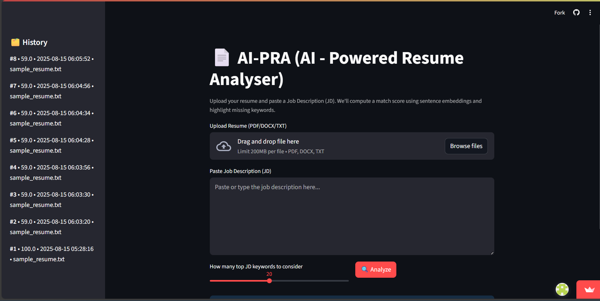
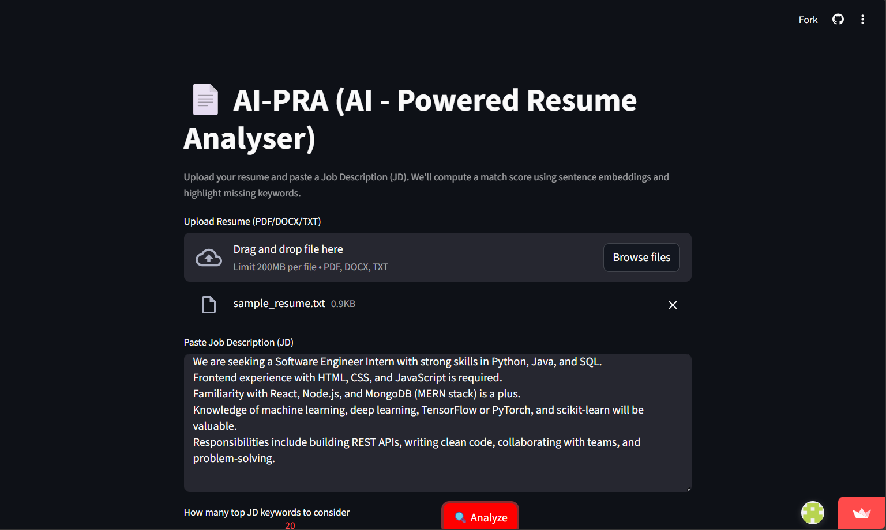
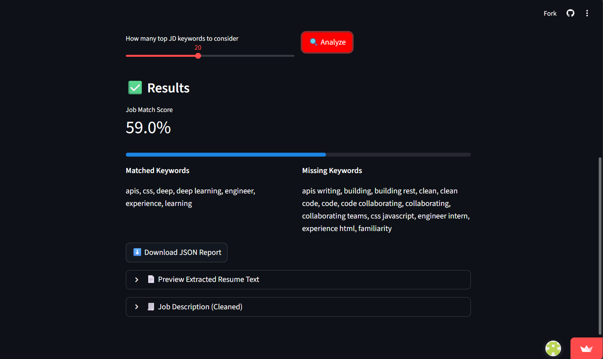
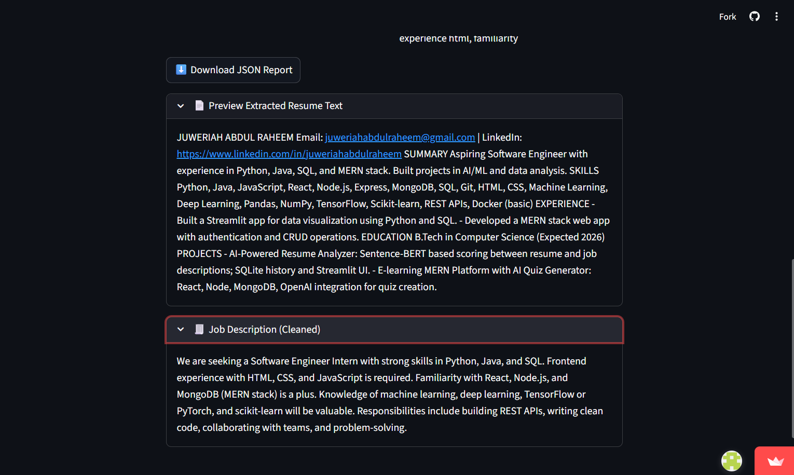

# 🧠 AI-Powered Resume Analyzer

An AI-based web application that analyzes resumes against job descriptions to provide a **job-match score**, highlight missing keywords, and give actionable feedback for better ATS (Applicant Tracking System) optimization.

## 🚀 Live Demo
[Click here to try it!](https://ai-pra.streamlit.app/)

---

## 📌Features

* **Resume Parsing**: Upload PDF/DOCX resumes and extract text.
* **Job Match Scoring**: AI-powered similarity calculation using Sentence-BERT embeddings.
* **Keyword Suggestions**: Highlights missing skills or keywords to improve ATS scores.
* **User-Friendly Interface**: Clean, responsive Streamlit app.
* **Database Storage**: Save analysis history using SQL.
* **Fast Deployment**: Hosted on Streamlit Cloud for instant access.

---

## 🛠️ Tech Stack

**Frontend & Deployment**

* Streamlit

**Backend & AI**

* Python 3
* Sentence-BERT (from `sentence-transformers`)
* scikit-learn, NumPy, pandas

**File Handling**

* PyPDF2 (for PDF extraction)
* python-docx (for DOCX extraction)

**Database (Optional)**

* SQLite / PostgreSQL

---

## 📂 Project Structure

```
AI-PRA/
│
├── app.py                # Main Streamlit application
├── requirements.txt      # Project dependencies
├── utils.py              # Helper functions (if used)
├── sample_data/          # Sample resumes and job descriptions
└── README.md             # Project documentation
```

---

## ⚙️ Installation & Local Setup

```bash
# Clone the repository
git clone https://github.com/J-riah/AI-PRA.git
cd AI-PRA

# Create virtual environment
python -m venv venv
source venv/bin/activate   # On Windows: venv\Scripts\activate

# Install dependencies
pip install -r requirements.txt

# Run the app locally
streamlit run app.py
```

---

## How It Works

1. **Upload Resume**: The app extracts text using PyPDF2 or python-docx.
2. **Paste Job Description**: Users input the job description they want to match against.
3. **AI Processing**: The app converts both texts into embeddings using Sentence-BERT.
4. **Similarity Score**: Cosine similarity determines the match percentage.
5. **Feedback**: Displays missing keywords and suggestions to improve the score.

## 🖼️ Screenshots

**AI-PRA**

**Resume Analysis Input**

**Keyword Suggestions and AI-PRA output**




## 📜 License
This project is open-source under the MIT License.

---

## 👩‍💻 Author
**Juweriah Abdul Raheem Mohammed**
📧 [juweriahabdulraheem@gmail.com](mailto:juweriahabdulraheem@gmail.com)
🔗 [LinkedIn](https://www.linkedin.com/in/juweriahabdulraheem) | [GitHub](https://github.com/J-riah)
